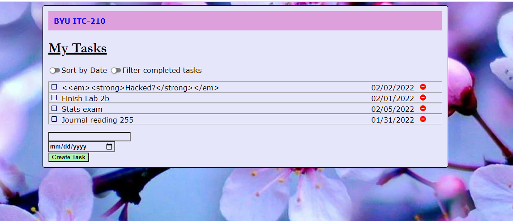
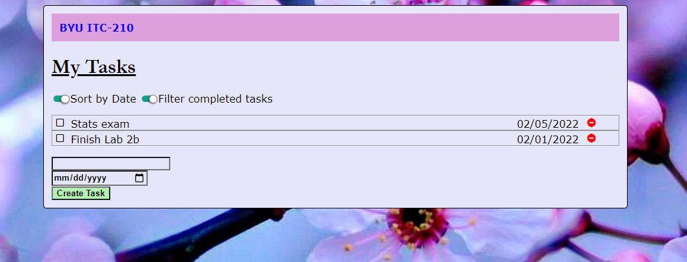
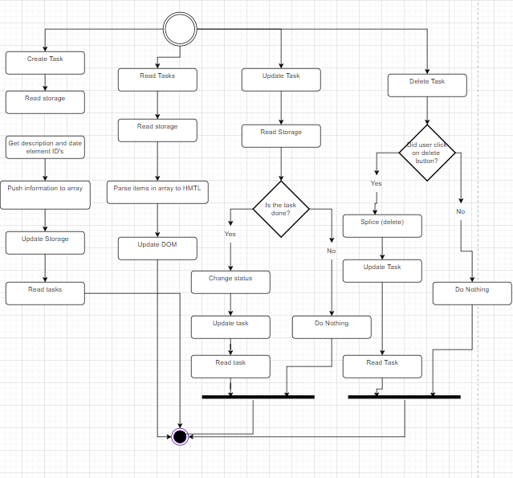
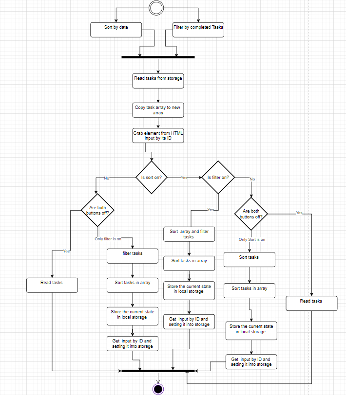

# Lab 1 Writeup

Name: Caroline Grahl
Date: 02/02/2022
Lab 2a - JavaScript Part 1 + Lab 2b - JavaScript Part 2

### Executive Summary
The objective of this lab was to make students more acquainted with **JavaScript**, **Document Object Model (DOM)**, and **JSON**. Understanding and manipulating these languages can be very useful not only when trying to prevent cross-side scripting, to help with making things work and storing things into the local storage. These languages are important parts of web development and make web sites run more smoothly. 

### Design Overview

#### File Descriptions
 index.html - The bones of the code, where things are organized structurally. The title of the page, the organization of paragraphs and lists and buttons should be there.
 style.css - The skin of the code, where the coloring, the styling, and everything to add beauty to the page is located.
 script.js - The muscles of the code, where functions are organized to make things work. That is where the functionality is located. 

### Writeup Questions

1. What are two differences and similarities between JavaScript and C++? 
JavaScript and C++ work with functions and assigned variables, however, JavaScript is dynamically typed whereas C++ is statically typed. Also, JavaScript was built for web development and C++ was built for everything else.  

2. What is the difference between JSON and JavaScript objects?
JSON is a format for storing and transporting data, while JavaScript objects are used to store a collection of data. JSON can be converted into JavaScript Objects (JSON.parse()) and JavaScript Objects can be converted into JSON (JSON.stringify()). 

3. If you open your web page in two different browsers, will changes on one appear on the other? Why or why not?
No, because they are different clients. For example, if I want to input my tasks on Opera, these tasks will not appear across on Google Chrome. I have proven that during this lab and all the tasks that I input in Opera did not appear in Chrome. 

4. How long did you spend on this lab?
I spent about 7 hours on lab 2a and 3 hours on 2b. I spent more time on 2a because I was having a hard time understanding how things worked in JavaScript and I needed to read a lot and watch a lot of videos as well. The second lab was a bit easier because I got a lot of help from the TA's and the concepts sunk in better.

5. How did you protect your site against Cross-Site Scripting? Which type of Cross-Site Scripting did you protect against?
I used the replaceAll() method with the HTML entities that are usually used when trying to implement Cross-Site Scripting, which are <, >, ', and ". After trying different types of text lines that would do things to the page, it was proven that the replaceAll() method really works. 

6. What is a Higher-Order Function?
High-Oder Functions perform operations on different functions. For example, the filter() and map() functions used on lab 2b. 

7. What are the differences between the oninput, onkeyup, and onchange events? When do they trigger, when might you use one over the others?
The oninput event will occur when there is input from the user interface. The onkeyup event will occur after the keyboard key is released. The onchange even will happen when the selection, the checked state, or the contents of an element have changed. Using these events depend on their functions. If input is needed, then oninput should be used; if proof that an event happened, then onkeyup should be used; if changes have been made, then onchange can be used. 

### Lessons Learned

##### Converting From JSON To JavaScript Object And Vice-Versa

When trying to exchange data to/from a web server it can be difficult to use JavaScript. In order to be able to manipulate the data better, using JSON.parse() will convert JSON strings into a JavaScript object. The other way around would be using the JSON.stringigy() method. 

##### Array Splice

It can be difficult to delete an item from an array. In C++, the erase() method is the common way but, in JavaScript, the splice() method is what is used. It can also overwrite the original array.

##### Setting a Storage Item -- Local Storage

Being able to save items into the local storage so, if something happens, the user will not lose anything, it is important to use the storage.setItem() method. This method will chedck if a key name and value already exists and will either add or update the storage object. 

### Conclusions

- Use JavaScript functions
- Use HTML within JavaScript
- Store data in local storage
- Convert JavaScript Object into JSON (using JSON.stringify())
- Use High-Order Functions

### References
1. [How to format a JS date ](https://stackoverflow.com/questions/3552461/how-to-format-a-javascript-date)
2. [How to format dates in JS](https://www.freecodecamp.org/news/how-to-format-dates-in-javascript/)
3. [UML Activity Diagrams](https://www.lucidchart.com/pages/uml-activity-diagram)
4. [Even Onclick Instructions](https://www.w3schools.com/jsref/event_onclick.asp)
5. [Using Splice](https://stackoverflow.com/questions/53255424/how-to-remove-dom-element-from-html-to-do-list-using-splice)
6. [Stringify](https://www.w3schools.com/js/js_json_stringify.asp)
7. [Conditional Operator](https://developer.mozilla.org/en-US/docs/Web/JavaScript/Reference/Operators/Conditional_Operator)
8. [HTML entities](https://dev.w3.org/html5/html-author/charref)
9. [How to sort an array by date properly](https://stackoverflow.com/questions/10123953/how-to-sort-an-object-array-by-date-property)
10. [ES6 Way to Clone an array](https://www.samanthaming.com/tidbits/35-es6-way-to-clone-an-array/)
11. [JS Array Filter](https://www.w3schools.com/jsref/jsref_filter.asp)
12. [How to replace HTML entity with a char in JS](https://stackoverflow.com/questions/21130559/how-to-replace-a-html-entity-with-a-char-in-javascript)
13. [JS Array Sort](https://www.w3schools.com/js/js_array_sort.asp)

### Feedback
This lab was really good, but I felt like there were things that could have been explained a bit better, or maybe there should be a couple more tips from where to go. I am not very good at JavaScript, so I was struggling quite a bit. However, I really enjoyed how the TA's were very helpful and kind. 
